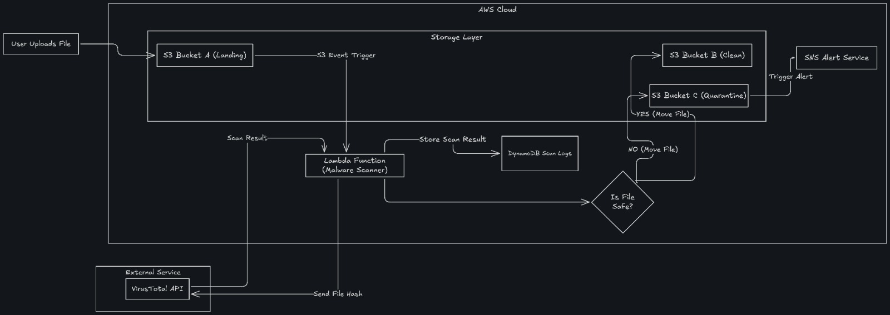

# ☁️ Cloud-Sentry: Automated Serverless Malware Scanning Pipeline

> A serverless, event-driven security architecture that eliminates the "blind spot" in cloud storage using AWS S3, Lambda, and the VirusTotal API.

**Subject:** Cloud Computing Lab  
**Team:** Shane Dias (10179) · Serene Dmello (10181) · Soham Kalgutkar (10192)

---

## 📋 Table of Contents

- [Overview](#overview)
- [Problem Statement](#problem-statement)
- [System Architecture](#system-architecture)
- [AWS Services](#aws-services)
- [Implementation Details](#implementation-details)
- [Industry Use Cases](#industry-use-cases)
- [Results](#results)

---

## Overview

**Cloud-Sentry** automatically intercepts file uploads to S3, performs a multi-engine malware scan via file hashing, and quarantines threats in real-time. It demonstrates the implementation of **Zero Trust** storage principles and automated incident response in a cloud-native environment.

---

## Problem Statement

As enterprises migrate to the cloud, S3 buckets have become a primary target for storage-based malware injection. Standard cloud storage does not inherently scan files for malicious payloads.

| Issue | Solution |
|---|---|
| Manual scanning is unscalable | Fully serverless pipeline — executes only on file detection |
| Traditional servers sit idle, increasing costs | 24/7 protection with zero maintenance overhead |

---

## System Architecture

The system follows a **decoupled, asynchronous** workflow:

### Workflow Stages

1. **Ingestion** — User uploads a file to the Landing S3 Bucket
2. **Trigger** — S3 emits an `s3:ObjectCreated:*` event, invoking the Scanner Lambda
3. **Processing** — Lambda calculates the **SHA-256 hash** of the file (file content never leaves the AWS environment)
4. **Analysis** — Hash is sent to VirusTotal API and checked against **70+ antivirus engines**
5. **Decision & Routing**
   - ✅ **Clean** → File moved to the Clean S3 Bucket
   - 🚨 **Infected** → File moved to the Quarantine S3 Bucket
6. **Logging & Alerting** — Results logged in DynamoDB; real-time email alert sent via SNS

---

## AWS Services

| Service | Role |
|---|---|
| **Amazon S3** | Storage Layer with three zones: Landing (Raw), Clean (Verified), Quarantine (Isolated) |
| **AWS Lambda** | Compute Layer — executes scanning logic, API calls, and file routing without managing servers |
| **Amazon DynamoDB** | Metadata Store — high-speed NoSQL audit log of scan results, hashes, and timestamps |
| **Amazon SNS** | Communication Layer — real-time email notifications to admins when a threat is identified |
| **AWS IAM** | Security Layer — implements Principle of Least Privilege for Lambda permissions |

---

## Implementation Details

### 🔐 Security & IAM Policy

A custom IAM execution role was created for the Lambda function, restricting it to only the specific S3 buckets in the pipeline — preventing unauthorized access to any other cloud resources.

### 🔗 Pre-signed URLs for Secure Upload

To avoid making the S3 bucket public, a **Pre-signed URL** strategy was implemented. This allows the frontend to upload files directly to S3 using a temporary security token valid for a limited duration.

### 🦠 Malware Detection Logic

The system uses **SHA-256 File Hashing** for detection.

- **Privacy:** File content never leaves the AWS environment — only the hash is sent externally
- **Speed:** Hash lookups are near-instantaneous
- **Testing:** Validated using the **EICAR Standard Anti-Virus Test File** to safely simulate a 100% detection rate

---

## Industry Use Cases

- **🏦 FinTech** — Protecting banking portals by scanning KYC documents (Aadhaar/PAN) to block malicious scripts
- **🏥 Healthcare** — Ensuring X-ray and lab reports are malware-free before being accessed by medical staff
- **⚖️ Legal Tech** — Scanning evidence files from external sources to prevent ransomware from locking sensitive case files

---

## Results

| Metric | Outcome |
|---|---|
| **Scalability** | Handled multiple concurrent uploads via Lambda's horizontal scaling |
| **Cost Efficiency** | Costs incurred only during active scan execution (seconds) |
| **Detection Rate** | 100% detection rate validated with EICAR test files |
| **Security Posture** | Zero Trust storage principles enforced across the pipeline |

By integrating automated security directly into the storage layer, Cloud-Sentry significantly reduces the risk of cross-user infection and cloud-based data breaches — with no infrastructure to manage.